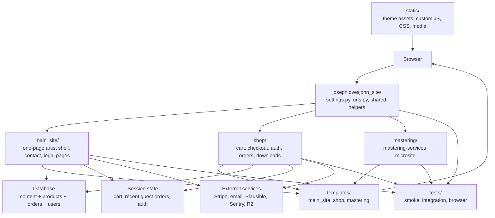
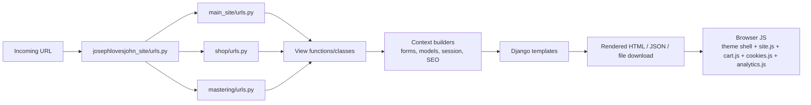
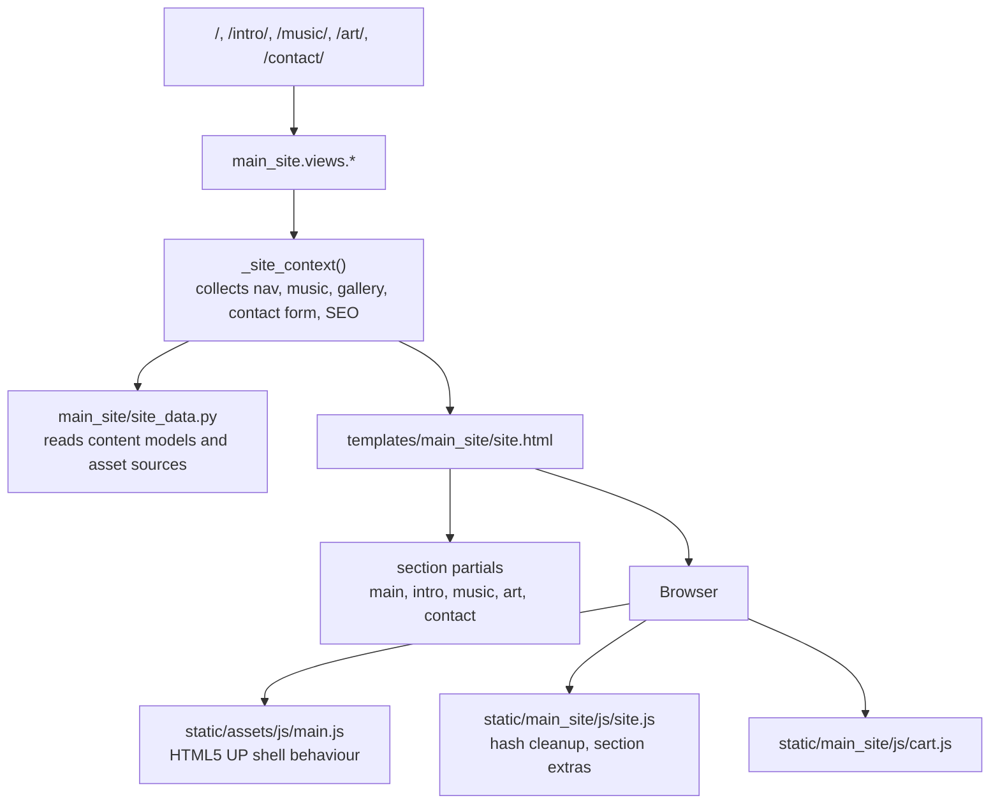
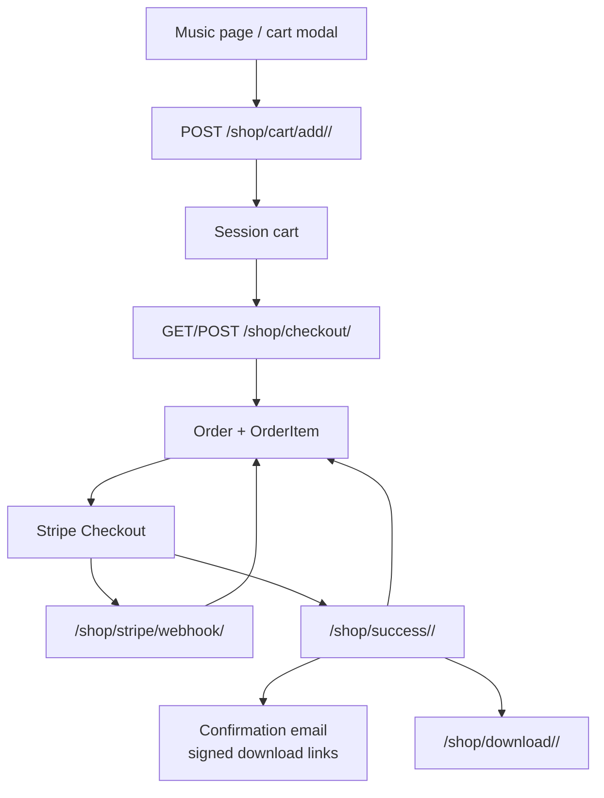
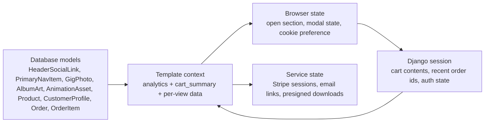

# Repository Architecture

This document is the quickest high-level map of how the JosephlovesJohn repository fits together.

If you want the short version:

- `josephlovesjohn_site/` is the Django project shell: settings, root URLs, shared helpers.
- `main_site/` renders the artist site and legal/contact pages.
- `shop/` owns cart, checkout, orders, accounts, downloads, and Stripe integration.
- `mastering/` is a separate routed microsite.
- `templates/` and `static/` hold most of the user-facing HTML, CSS, and JS.
- `tests/` is the best place to confirm expected behaviour.

## Repo Overview

## Request Flow

## Main Site Flow

The key idea is that the main artist site is a one-page shell rendered by Django, then enhanced in the browser.

- Django decides the initial active section using routes like `/music/` or `/contact/`.
- The frontend can then move between sections with hashes like `#music`.
- `static/assets/js/main.js` handles most of the original shell transitions.
- `static/main_site/js/site.js` adds repo-specific behaviour on top.

## Shop Flow

For the detailed checkout sequence, see [shop-flow.md](/Users/johnjoseph/PycharmProjects/JosephlovesJohn_website/docs/shop-flow.md).

## Runtime State

## How To Understand The Repo Fully

Read it in this order:

1. Start with [README.md](/Users/johnjoseph/PycharmProjects/JosephlovesJohn_website/README.md) and this file.
2. Read [josephlovesjohn_site/urls.py](/Users/johnjoseph/PycharmProjects/JosephlovesJohn_website/josephlovesjohn_site/urls.py) to see the top-level split between `main_site`, `shop`, and `mastering`.
3. Read [josephlovesjohn_site/settings.py](/Users/johnjoseph/PycharmProjects/JosephlovesJohn_website/josephlovesjohn_site/settings.py) to understand environment, middleware, static files, sessions, Stripe, email, analytics, and storage.
4. Read [main_site/views.py](/Users/johnjoseph/PycharmProjects/JosephlovesJohn_website/main_site/views.py), then [templates/main_site/site.html](/Users/johnjoseph/PycharmProjects/JosephlovesJohn_website/templates/main_site/site.html), then [static/main_site/js/site.js](/Users/johnjoseph/PycharmProjects/JosephlovesJohn_website/static/main_site/js/site.js).
5. Read [shop/views.py](/Users/johnjoseph/PycharmProjects/JosephlovesJohn_website/shop/views.py) together with [shop/models.py](/Users/johnjoseph/PycharmProjects/JosephlovesJohn_website/shop/models.py) and [docs/shop-flow.md](/Users/johnjoseph/PycharmProjects/JosephlovesJohn_website/docs/shop-flow.md).
6. Read [main_site/models.py](/Users/johnjoseph/PycharmProjects/JosephlovesJohn_website/main_site/models.py) to see what content is editable in the admin.
7. Read [shop/context_processors.py](/Users/johnjoseph/PycharmProjects/JosephlovesJohn_website/shop/context_processors.py) and [main_site/context_processors.py](/Users/johnjoseph/PycharmProjects/JosephlovesJohn_website/main_site/context_processors.py) to see what every template gets automatically.
8. Read the browser tests in [tests/test_browser_ui.py](/Users/johnjoseph/PycharmProjects/JosephlovesJohn_website/tests/test_browser_ui.py) and the smoke/integration tests around it. They describe expected behaviour better than comments alone.

Use these questions while reading:

- Which URL reaches this code?
- Is this server-side state, session state, or browser-only state?
- Which template renders this output?
- Which JavaScript file changes it after load?
- Which test proves it should work this way?

## Best Practical Method

If you want to really internalise the repository rather than just skim it:

1. Trace one complete user journey at a time.
   Start with “open `/music/`, add to cart, checkout, pay, download”.
2. Keep the browser, the Django view, the template, and the JS file open side by side.
3. After each step, find the test that covers that behaviour.
4. Write your own tiny notes in this format:
   `URL -> view -> template -> JS -> state -> test`
5. Repeat for:
   `contact form`
   `legal pages`
   `account/login/reset`
   `mastering-services/`

Once you can do that from memory for those flows, you effectively understand the repo.
