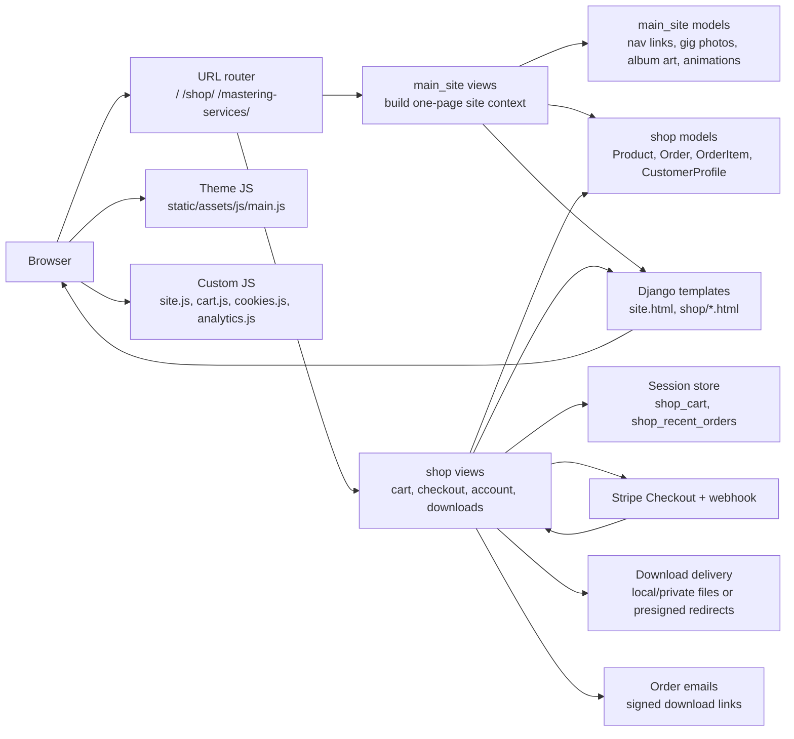
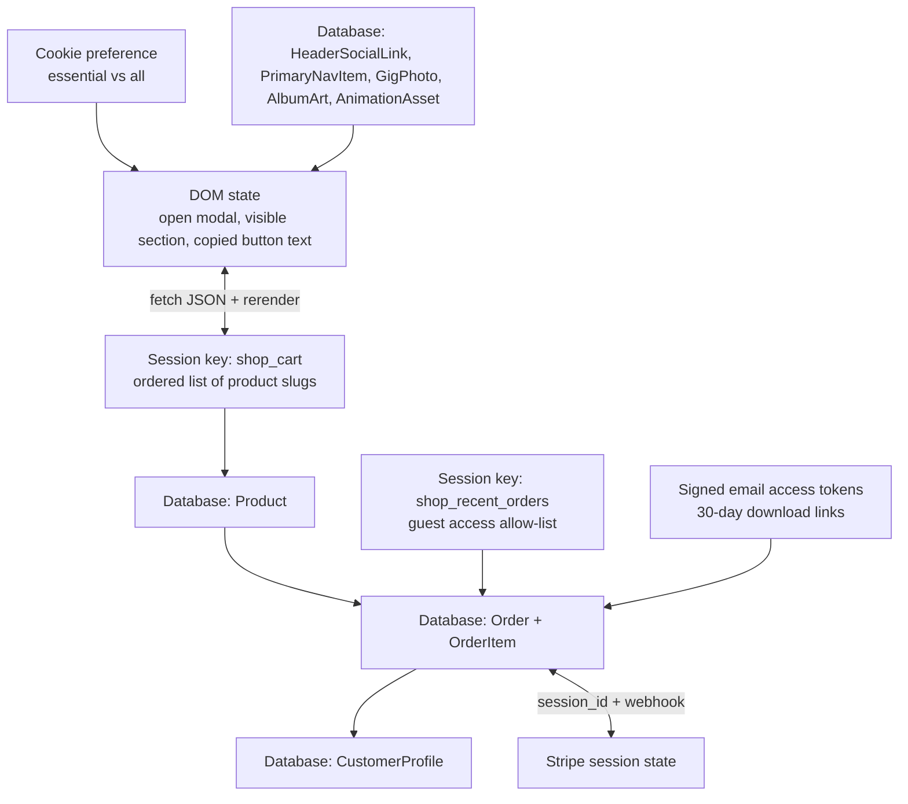
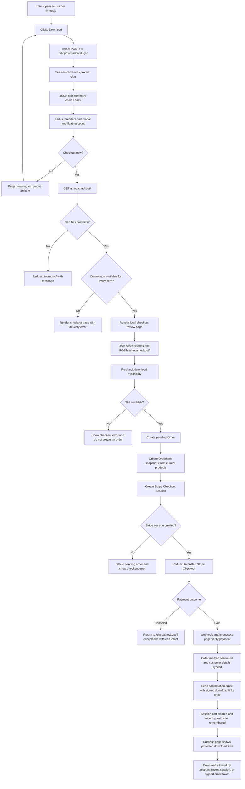
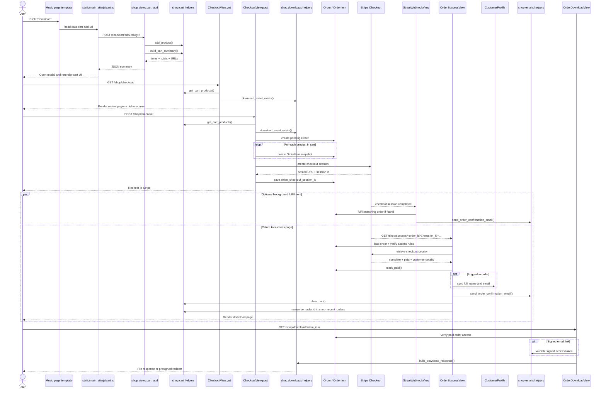
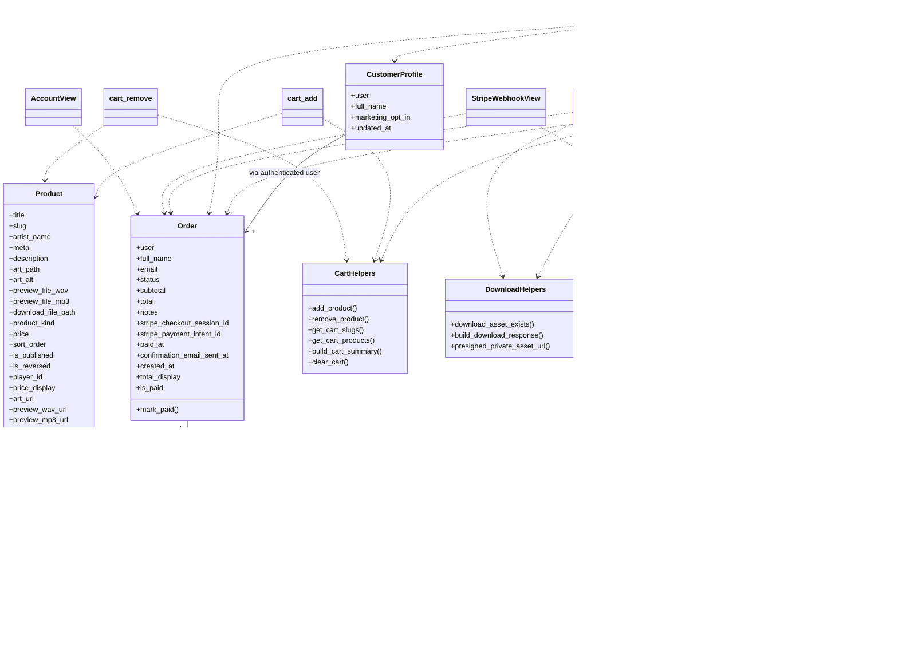

# Shop Flow

This document maps how the JosephlovesJohn site is wired together today, with extra focus on where state lives and what each JavaScript file is responsible for.

## Site Architecture

## State And Stores

## Checkout Journey

## Checkout Sequence

## Core Shop Models

## Notes

- There is no front-end store library here. The main "stores" are Django sessions, the database, and the DOM.
- `shop_cart` is a session-backed list of product slugs. It is not a quantity-based basket.
- `shop_recent_orders` is a session-backed allow-list so guest users can revisit their own success page and downloads.
- The site is mostly server-rendered. Django builds HTML first, then JavaScript enhances that HTML.
- `static/assets/js/main.js` is the HTML5 UP shell controller. It handles hash-based article switching, header/footer visibility, top-nav docking, and the mastering-link transition.
- `static/main_site/js/site.js` handles custom UI enhancements: lazy-loading the signup embed, audio player setup, share modal behavior, and the art lightbox.
- `static/main_site/js/cart.js` handles add/remove cart requests, receives JSON summaries from Django, and rerenders the cart modal client-side.
- `static/main_site/js/cookies.js` only manages the cookie banner visibility and its dismissal cookie.
- `templates/shop/checkout.html` also contains a tiny inline script that enables or disables the submit button based on the consent checkbox.
- Orders are created as `pending` before redirecting to Stripe, then confirmed either on the success-page verification path or via webhook fulfillment.

## Main Files

- [shop/views.py](/Users/johnjoseph/PycharmProjects/JosephlovesJohn_website/shop/views.py)
- [shop/cart.py](/Users/johnjoseph/PycharmProjects/JosephlovesJohn_website/shop/cart.py)
- [shop/models.py](/Users/johnjoseph/PycharmProjects/JosephlovesJohn_website/shop/models.py)
- [shop/context_processors.py](/Users/johnjoseph/PycharmProjects/JosephlovesJohn_website/shop/context_processors.py)
- [shop/forms.py](/Users/johnjoseph/PycharmProjects/JosephlovesJohn_website/shop/forms.py)
- [main_site/views.py](/Users/johnjoseph/PycharmProjects/JosephlovesJohn_website/main_site/views.py)
- [templates/main_site/site.html](/Users/johnjoseph/PycharmProjects/JosephlovesJohn_website/templates/main_site/site.html)
- [templates/main_site/includes/components/music/library_item.html](/Users/johnjoseph/PycharmProjects/JosephlovesJohn_website/templates/main_site/includes/components/music/library_item.html)
- [static/main_site/js/cart.js](/Users/johnjoseph/PycharmProjects/JosephlovesJohn_website/static/main_site/js/cart.js)
- [static/main_site/js/site.js](/Users/johnjoseph/PycharmProjects/JosephlovesJohn_website/static/main_site/js/site.js)
- [static/main_site/js/cookies.js](/Users/johnjoseph/PycharmProjects/JosephlovesJohn_website/static/main_site/js/cookies.js)
- [static/assets/js/main.js](/Users/johnjoseph/PycharmProjects/JosephlovesJohn_website/static/assets/js/main.js)
- [tests/test_shop_flow.py](/Users/johnjoseph/PycharmProjects/JosephlovesJohn_website/tests/test_shop_flow.py)
- [tests/test_browser_ui.py](/Users/johnjoseph/PycharmProjects/JosephlovesJohn_website/tests/test_browser_ui.py)
