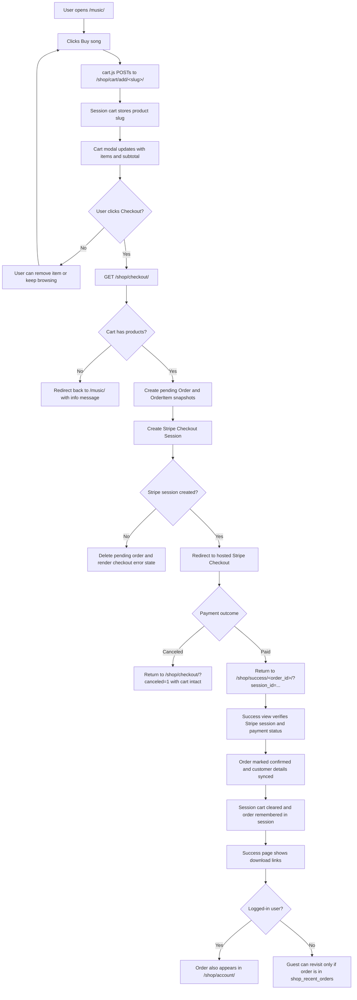
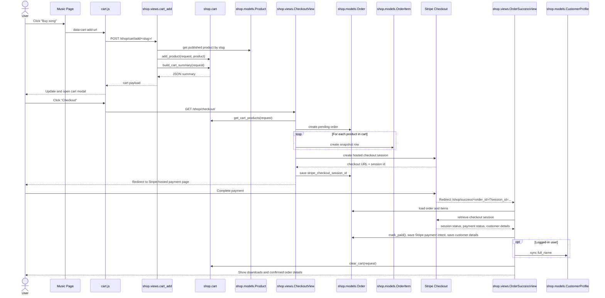
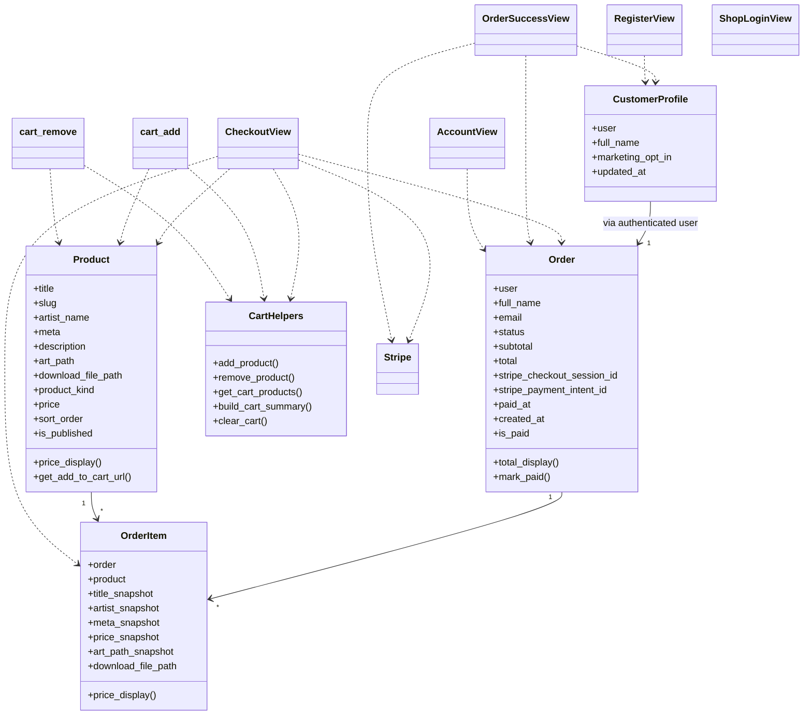

# Shop Flow

This document maps the current shop implementation in the Django app as it exists today.

## User Journey

## Sequence Diagram

## Class Diagram

## Notes

- The cart is session-backed and stores product slugs, not quantities.
- Checkout is Stripe-hosted. The local checkout page is now mainly a fallback surface for cancellation and startup errors.
- Orders are created as `pending` before redirecting to Stripe.
- The cart is only cleared after the success view re-validates the Stripe session as `complete` and `paid`.
- Guest success pages are protected by `shop_recent_orders` in session.
- Logged-in users can review confirmed purchases in `/shop/account/`.

## Main Files

- [shop/views.py](/Users/johnjoseph/PycharmProjects/JosephlovesJohn_website/shop/views.py)
- [shop/cart.py](/Users/johnjoseph/PycharmProjects/JosephlovesJohn_website/shop/cart.py)
- [shop/models.py](/Users/johnjoseph/PycharmProjects/JosephlovesJohn_website/shop/models.py)
- [shop/forms.py](/Users/johnjoseph/PycharmProjects/JosephlovesJohn_website/shop/forms.py)
- [main_site/views.py](/Users/johnjoseph/PycharmProjects/JosephlovesJohn_website/main_site/views.py)
- [static/main_site/js/cart.js](/Users/johnjoseph/PycharmProjects/JosephlovesJohn_website/static/main_site/js/cart.js)
- [tests/test_shop_flow.py](/Users/johnjoseph/PycharmProjects/JosephlovesJohn_website/tests/test_shop_flow.py)
- [tests/test_browser_ui.py](/Users/johnjoseph/PycharmProjects/JosephlovesJohn_website/tests/test_browser_ui.py)
