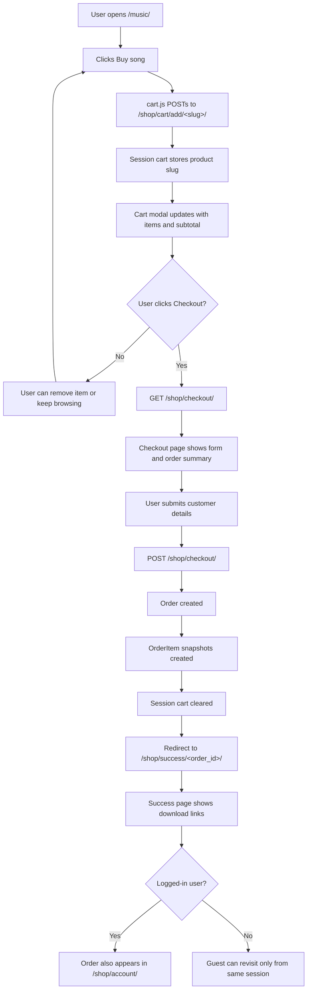
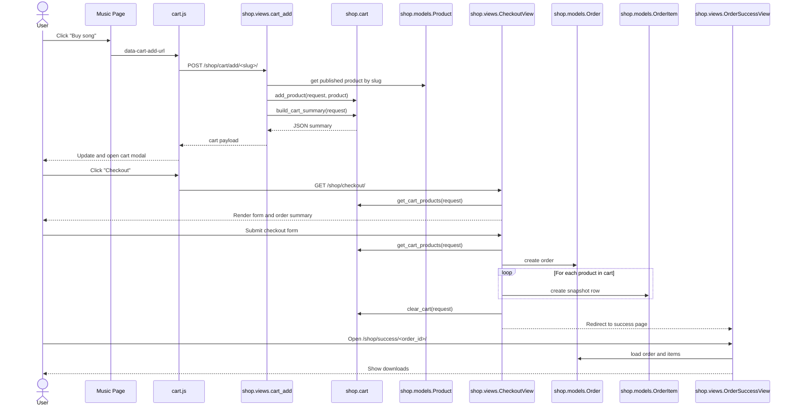
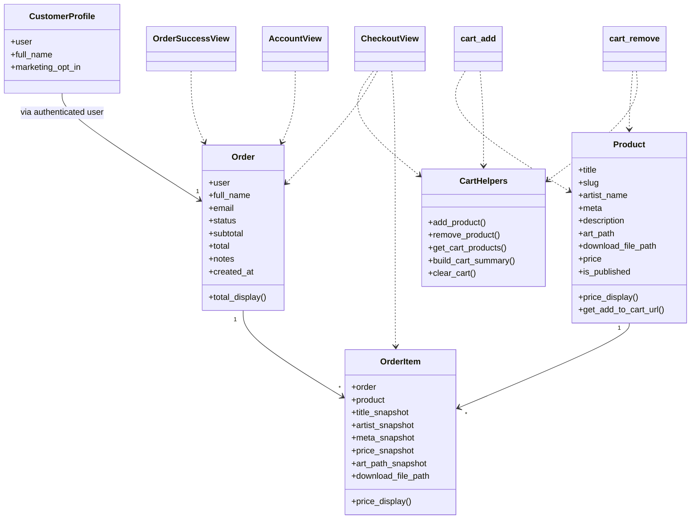

# Shop Flow

This document maps the current shop implementation in the Django app.

## User Journey

## Sequence Diagram

## Class Diagram

## Main Files

- [shop/views.py](/Users/johnjoseph/PycharmProjects/JosephlovesJohn_website/shop/views.py)
- [shop/cart.py](/Users/johnjoseph/PycharmProjects/JosephlovesJohn_website/shop/cart.py)
- [shop/models.py](/Users/johnjoseph/PycharmProjects/JosephlovesJohn_website/shop/models.py)
- [main_site/views.py](/Users/johnjoseph/PycharmProjects/JosephlovesJohn_website/main_site/views.py)
- [static/main_site/js/cart.js](/Users/johnjoseph/PycharmProjects/JosephlovesJohn_website/static/main_site/js/cart.js)
- [tests/test_shop_flow.py](/Users/johnjoseph/PycharmProjects/JosephlovesJohn_website/tests/test_shop_flow.py)
- [tests/test_browser_ui.py](/Users/johnjoseph/PycharmProjects/JosephlovesJohn_website/tests/test_browser_ui.py)
